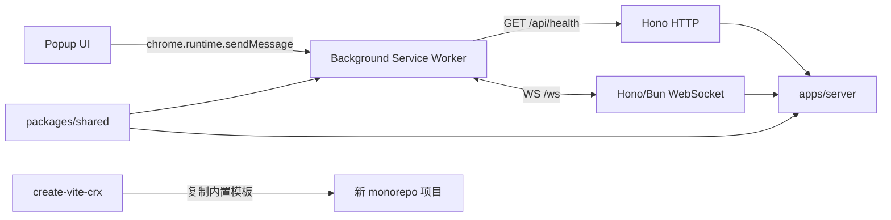
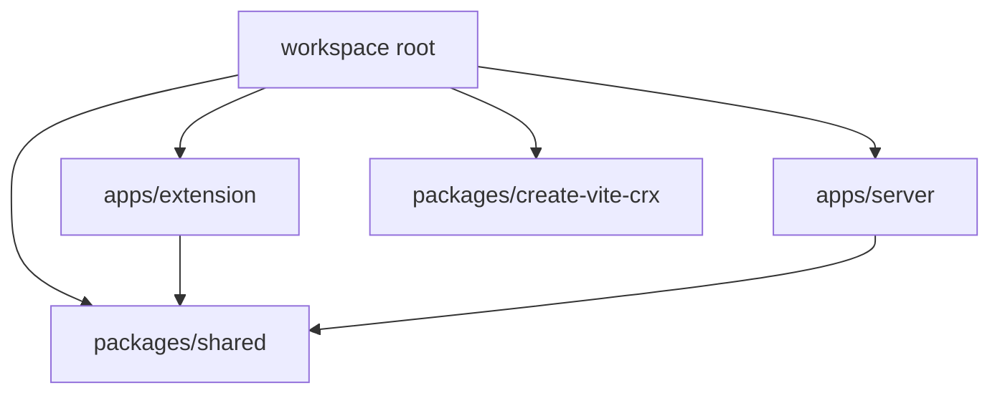
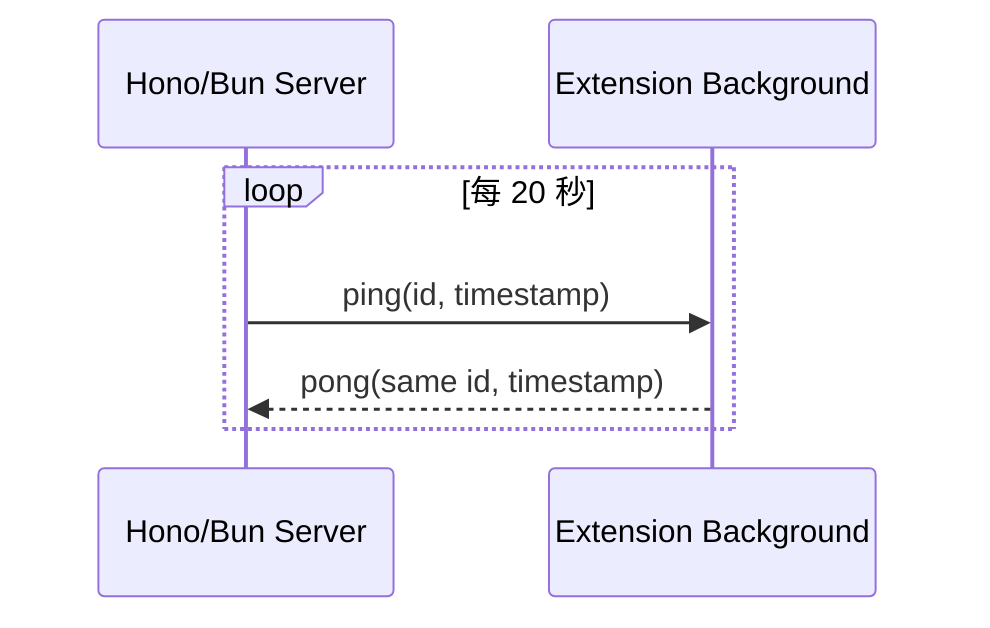
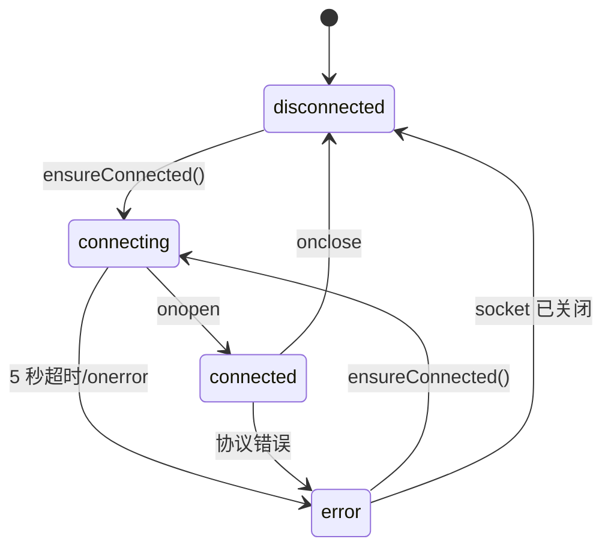
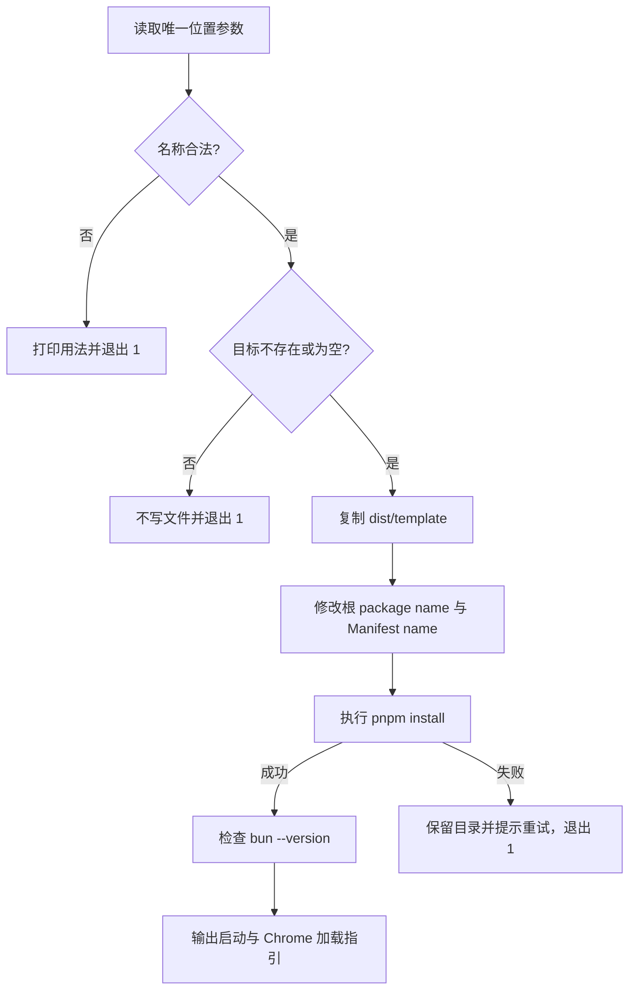

> [!abstract] 方案摘要
> 在不改变现有 Chrome Extension 构建语义的前提下，将仓库迁移为 pnpm monorepo；新增 Bun + Hono 本地服务、共享协议包和 `create-vite-crx` 生成器。插件的 HTTP/WebSocket 网络访问统一收口到 Background Service Worker，并以服务端心跳维持 Chrome 116+ 中的活动连接。

## 1. 文档范围

本文是 [[Vite CRX Monorepo、CLI 与本地服务 MVP]] 的实现方案，回答以下问题：

- 现有单包仓库如何迁移，且不破坏双 Vite 构建、Content Script CSS、热更新和输出目录。
- workspace package 如何划分、依赖和执行脚本。
- Hono + Bun 如何提供 HTTP、WebSocket echo 和服务端心跳。
- Background 如何管理唯一 WebSocket、并发请求、超时、异常和 Service Worker 重启。
- `create-vite-crx` 如何从当前仓库构造内置模板并安全生成新项目。
- 自动测试和真实 Chrome 冒烟如何分层。

> [!failure] 不在本文设计范围内
> 服务端生产部署、Node.js 运行时适配、认证、数据库、远端环境、业务广播、浏览器自动化 E2E 和 npm 自动发布。

## 2. 现状与迁移原则

### 2.1 现状

当前仓库的关键约束：

- 根目录 `package.json` 承载插件全部依赖和命令。
- `vite.config.ts` 构建 Background、Popup、Options 和 Side Panel，输出 ES module。
- `vite.content.config.ts` 单独将 Content Script 构建为 IIFE。
- `scripts/monitor.js` 复制 Manifest、HTML 和静态资源，并在开发模式监听源文件。
- 开发热更新使用 `ws://127.0.0.1:8801`，与本期新增的业务 WebSocket 不是同一条连接。
- `src/shared/message.ts` 通过 `TaskMap` 提供插件内部的类型化消息。
- Vitest 运行在 Node 环境，`src/test/setup.ts` 提供 IndexedDB 和 Chrome API mock。

### 2.2 迁移原则

1. **先搬迁，后改行为**：第一阶段只移动插件文件和修正路径；基线命令通过后再增加服务端功能。
2. **运行时依赖归属使用者**：Vue/Vite 依赖属于 Extension，Hono 属于 Server，共享包只包含无运行时平台依赖的 TypeScript。
3. **workspace 依赖显式使用 `workspace:*`**：禁止意外从 registry 安装同名包。
4. **网络边界只有 Background**：Popup、Options 和 Content Script 不得到任意 URL 代理能力。
5. **模板最后生成**：CLI 模板从已经通过验证的 monorepo 白名单构造，避免维护第二份手工副本。
6. **不引入任务编排框架**：MVP 直接使用 pnpm 的 workspace filter 与并行运行能力。

## 3. 技术决策

| 决策 | 选择 | 理由 |
| --- | --- | --- |
| Workspace | pnpm 11 | 延续当前包管理器，单 lockfile，原生支持 `workspace:` 协议 |
| Node.js | `>=22` | 延续当前 Vite、CLI 和仓库工具链要求 |
| Bun | `>=1.3.0` | 作为本期服务端唯一运行时；直接执行 TypeScript，版本线足以覆盖当前 Hono/Bun 适配能力 |
| 服务框架 | `hono@^4.13.5` | 当前 registry 版本；提供 Bun HTTP 与 WebSocket 适配，API 足够轻量 |
| Bun 类型 | `@types/bun@^1.4.0` | TypeScript 6 需要显式声明 `types: ["bun"]` |
| 共享代码 | 源码 workspace package | Vite 与 Bun 都能直接消费 TypeScript，MVP 不增加共享包构建产物 |
| CLI 运行时 | Node.js ESM | `pnpm create` 的宿主稳定，服务端采用 Bun 不要求生成器也绑定 Bun |
| CLI 编译 | `tsc` | 已有 TypeScript 工具链，无需增加 bundler |
| 服务端测试 | `bun test` | WebSocket 集成测试必须运行在真实 Bun 适配器上 |
| 插件/共享/CLI 测试 | Vitest | 延续现有测试体系和 mock |

> [!warning] Bun 环境前置条件
> 当前开发机尚未安装 Bun。文档设计不受影响，但开始实现 Server 或运行根 `pnpm test` 前必须安装 Bun，并用 `bun --version` 验证版本不低于 1.3.0。CLI 在 Bun 缺失时仍需完成项目生成，只输出警告。

## 4. 目标架构



### 4.1 依赖方向



> [!danger] 依赖规则
> `packages/shared` 不得依赖 Chrome、Vue、Hono、Bun 或 Node.js API；Extension 和 Server 不得依赖 `create-vite-crx`；CLI 只能在构造模板时读取白名单文件，不能把自身复制进生成项目。

## 5. 目录设计

```text
.
├── apps/
│   ├── extension/
│   │   ├── src/
│   │   │   ├── background/
│   │   │   │   ├── network/
│   │   │   │   │   ├── errors.ts
│   │   │   │   │   ├── httpClient.ts
│   │   │   │   │   ├── index.ts
│   │   │   │   │   └── webSocketClient.ts
│   │   │   │   └── index.ts
│   │   │   ├── popup/
│   │   │   ├── shared/
│   │   │   │   └── message.ts
│   │   │   ├── test/
│   │   │   └── manifest.json
│   │   ├── scripts/
│   │   │   ├── hot-reload/
│   │   │   └── monitor.js
│   │   ├── const.ts
│   │   ├── eslint.config.mjs
│   │   ├── package.json
│   │   ├── tsconfig.json
│   │   ├── vite.config.ts
│   │   ├── vite.content.config.ts
│   │   └── vitest.config.ts
│   └── server/
│       ├── src/
│       │   ├── app.ts
│       │   ├── constants.ts
│       │   ├── heartbeat.ts
│       │   └── index.ts
│       ├── test/
│       │   ├── health.test.ts
│       │   └── websocket.test.ts
│       ├── package.json
│       └── tsconfig.json
├── packages/
│   ├── shared/
│   │   ├── src/
│   │   │   ├── config.ts
│   │   │   ├── health.ts
│   │   │   ├── index.ts
│   │   │   └── websocket.ts
│   │   ├── test/
│   │   ├── package.json
│   │   └── tsconfig.json
│   └── create-vite-crx/
│       ├── src/
│       │   ├── cli.ts
│       │   ├── createProject.ts
│       │   └── validateProjectName.ts
│       ├── scripts/
│       │   └── build-template.mjs
│       ├── test/
│       ├── dist/
│       │   ├── cli.js
│       │   └── template/
│       ├── package.json
│       └── tsconfig.json
├── docs/
├── .husky/
├── eslint.config.mjs
├── package.json
├── pnpm-lock.yaml
├── pnpm-workspace.yaml
└── README.md
```

### 5.1 现有文件迁移映射

| 当前路径 | 目标路径 | 处理 |
| --- | --- | --- |
| `src/**` | `apps/extension/src/**` | 原样移动后修正新增 workspace import |
| `scripts/**` | `apps/extension/scripts/**` | 原样移动，保留热更新实现 |
| `const.ts` | `apps/extension/const.ts` | 增加 workspace root 与绝对输出路径 |
| `vite*.ts` | `apps/extension/vite*.ts` | 保留 `.ts` 扩展名导入和原生配置加载方式 |
| `vitest.config.ts` | `apps/extension/vitest.config.ts` | alias 与 setup 路径保持相对 Extension 根目录 |
| `tsconfig.json` | `apps/extension/tsconfig.json` | 保留插件 DOM/Chrome 类型 |
| `eslint.config.mjs` | 根目录 | 扩大扫描范围并按 package 忽略生成物 |
| `package.json` | 根目录 + 各 package | 根目录只负责编排；依赖下沉到使用方 |
| `pnpm-lock.yaml` | 根目录 | 重新安装后生成唯一 workspace lockfile |

## 6. Workspace 配置

### 6.1 `pnpm-workspace.yaml`

```yaml
packages:
  - apps/*
  - packages/*

minimumReleaseAgeExclude:
  - unplugin-auto-import@21.1.0
```

内部依赖统一声明为：

```json
{
  "dependencies": {
    "@vite-crx/shared": "workspace:*"
  }
}
```

`workspace:*` 保证 pnpm 只能解析本地包，避免 registry 上的同名包被误装。workspace 默认使用共享 lockfile，因此仓库只保留根 `pnpm-lock.yaml`。

### 6.2 根 `package.json`

根 package 设为 `private: true`，建议脚本：

```json
{
  "name": "vite-crx-template",
  "private": true,
  "type": "module",
  "packageManager": "pnpm@11.22.0",
  "engines": {
    "node": ">=22"
  },
  "scripts": {
    "dev": "pnpm --parallel --stream --filter @vite-crx/extension --filter @vite-crx/server run dev",
    "dev:extension": "pnpm --filter @vite-crx/extension dev",
    "dev:server": "pnpm --filter @vite-crx/server dev",
    "build": "pnpm --filter @vite-crx/extension build",
    "clear": "pnpm --filter @vite-crx/extension clear",
    "lint": "eslint apps packages",
    "typecheck": "pnpm -r --if-present typecheck",
    "test": "pnpm -r --if-present test",
    "pack:cli": "pnpm --filter create-vite-crx pack"
  }
}
```

说明：

- `dev` 只筛选两个 app，不会启动 CLI 或测试 watcher。
- `build` 保持“构建可发布 Chrome Extension”的现有语义；服务端生产构建不在 MVP 中。
- `test` 会包含 `apps/server` 的 `bun test`，因此完整测试要求已安装 Bun。
- Husky 与 lint-staged 保留在仓库根，匹配路径扩展到 `apps/**` 和 `packages/**`。

### 6.3 Package 职责

| Package | `private` | 主要依赖 | 主要命令 |
| --- | --- | --- | --- |
| `@vite-crx/extension` | 是 | Vue、Element Plus、Vite、`@vite-crx/shared` | `dev`、`build`、`test`、`typecheck` |
| `@vite-crx/server` | 是 | Hono、`@vite-crx/shared` | `dev`、`test`、`typecheck` |
| `@vite-crx/shared` | 是 | 无运行时依赖 | `test`、`typecheck` |
| `create-vite-crx` | 否 | Node.js 内置模块；开发期 TypeScript/Vitest | `build`、`test`、`pack` |

## 7. Extension 构建迁移

### 7.1 输出目录

移动后 `import.meta.dirname` 指向 `apps/extension`。`const.ts` 应显式计算：

```ts
import { resolve } from 'node:path'

export const extensionRoot = import.meta.dirname
export const workspaceRoot = resolve(extensionRoot, '../..')
export const bgUpdatePort = 8801
export const __DEV__ = process.env.CRX_ENV === 'development'
export const outputDir = resolve(
  workspaceRoot,
  __DEV__ ? 'local' : 'extension'
)
```

两个 Vite 配置的 `root` 仍是 `apps/extension/src`，但 `build.outDir` 直接使用绝对 `outputDir`。Content Script 输出到 `resolve(outputDir, 'contentScript')`。

### 7.2 `scripts/monitor.js`

脚本需要区分两个根：

- `extensionRoot`：`apps/extension`，用于读取 `src/manifest.json`、HTML 和 assets。
- `workspaceRoot`：仓库根，用于写入 `local/` 或 `extension/`。

复制 Manifest 时不再使用裸文件复制，而是读取 JSON、按环境调整 CSP 后写出。这同时解决业务 WebSocket 与现有热更新 WebSocket 的权限冲突。

### 7.3 Content Script CSS 不变量

迁移不得改写 `vite-content-script-css` 的核心行为：

- `enforce: 'post'`。
- 将 bundle CSS 中的 `:root` 改为 `:host`。
- bundle 无 CSS 时仍生成 `contentScript/style.css`。
- Manifest 的 `web_accessible_resources` 继续包含该文件。

### 7.4 热更新不变量

- `bgUpdatePort` 保持 8801。
- Background 业务 WebSocket 固定 8787，二者不复用连接、协议或重连状态。
- 开发产物加载路径必须仍是根目录 `local/`。
- `scripts/hot-reload/injectCode.js` 继续只注入开发 Background bundle。

## 8. 共享协议包

### 8.1 Package 导出

`packages/shared/package.json`：

```json
{
  "name": "@vite-crx/shared",
  "version": "0.0.0",
  "private": true,
  "type": "module",
  "exports": {
    ".": "./src/index.ts"
  }
}
```

该 package 不生成 `dist/`。Vite 在浏览器构建期转换源码，Bun 在服务端运行时直接加载 `.ts`。协议代码只能使用标准 ECMAScript/Web API。

### 8.2 固定配置

```ts
export const SERVER_HOST = 'localhost'
export const SERVER_PORT = 8787
export const HTTP_BASE_URL = `http://${SERVER_HOST}:${SERVER_PORT}`
export const WS_URL = `ws://${SERVER_HOST}:${SERVER_PORT}/ws`
export const NETWORK_TIMEOUT_MS = 5_000
export const HEARTBEAT_INTERVAL_MS = 20_000
export const HEARTBEAT_TIMEOUT_MS = 30_000
```

集中常量避免 Background、Server 和测试出现端口或超时漂移。生产代码不得从 Popup 参数或环境变量覆盖这些值。

### 8.3 HTTP 类型与校验

```ts
export interface HealthResponse {
  status: 'ok'
  timestamp: string
}

export const isHealthResponse = (value: unknown): value is HealthResponse => {
  // 校验对象、status、timestamp 字符串及可解析日期
}
```

### 8.4 WebSocket 类型

```ts
export interface BaseMessage<TType extends string, TData> {
  type: TType
  id: string
  data: TData
}

export type PingMessage = BaseMessage<'ping', { timestamp: string }>
export type PongMessage = BaseMessage<'pong', { timestamp: string }>
export type EchoRequest = BaseMessage<'echo-request', { text: string }>
export type EchoResponse = BaseMessage<'echo-response', { text: string }>

export type ClientMessage = PongMessage | EchoRequest
export type ServerMessage = PingMessage | EchoResponse
export type WebSocketMessage = ClientMessage | ServerMessage
```

共享包提供方向明确的解析函数：

```ts
parseClientMessage(raw: unknown): ClientMessage
parseServerMessage(raw: unknown): ServerMessage
serializeMessage(message: WebSocketMessage): string
```

解析函数失败时抛出共享的 `ProtocolError`。方向校验可以阻止客户端向服务端发送 `echo-response`，也可以阻止服务端向 Background 发送 `echo-request`。

> [!info] 不引入 schema 库
> 协议只有四个小型消息，手写 type guard 足以覆盖。引入 Zod 等依赖会扩大浏览器 bundle 和模板依赖面，与 MVP 不匹配。

## 9. Server 设计

### 9.1 文件职责

- `app.ts`：创建 Hono app、注册 `/api/health` 和 `/ws`。
- `heartbeat.ts`：封装单连接心跳计时器与清理逻辑。
- `constants.ts`：复用共享常量，定义关闭码。
- `index.ts`：导出 Bun server options，作为 `bun --hot` 入口。

### 9.2 启动入口

```ts
import { websocket } from 'hono/bun'
import { app } from './app.ts'
import { SERVER_HOST, SERVER_PORT } from '@vite-crx/shared'

export const serverOptions = {
  hostname: SERVER_HOST,
  port: SERVER_PORT,
  fetch: app.fetch,
  websocket
} satisfies Bun.Serve.Options

export default serverOptions
```

开发命令：

```json
{
  "scripts": {
    "dev": "bun --hot src/index.ts",
    "test": "bun test",
    "typecheck": "tsc --noEmit"
  }
}
```

服务器显式绑定 `localhost`，不使用 Bun 默认的全网卡监听。

### 9.3 HTTP

```ts
app.get('/api/health', (context) => {
  return context.json({
    status: 'ok',
    timestamp: new Date().toISOString()
  } satisfies HealthResponse)
})
```

不注册 CORS 中间件。Background 依靠 Manifest host permission 发起固定跨域请求；同时避免 Hono 官方文档提示的“修改 headers 的中间件与 WebSocket upgrade 冲突”。

### 9.4 WebSocket 处理

`/ws` 使用 `upgradeWebSocket` from `hono/bun`。每次连接创建独立闭包状态：

```ts
type HeartbeatState = {
  intervalId: ReturnType<typeof setInterval> | null
  timeoutId: ReturnType<typeof setTimeout> | null
  pendingPingId: string | null
}
```

消息规则：

- 收到合法 `echo-request`：立即回传相同 `id` 和 `data.text` 的 `echo-response`。
- 收到与 `pendingPingId` 相同的合法 `pong`：清除本次超时，等待下一轮心跳。
- 收到过期或未知 `pong`：忽略并记录一条有限日志。
- 收到非法 JSON、错误方向或字段缺失：以关闭码 `1003` 关闭连接。
- `onClose`/`onError`：清理 interval 和 timeout，保证无悬挂计时器。

### 9.5 心跳算法



精确行为：

1. 连接打开后启动 20 秒 interval。
2. interval 触发且没有未决心跳时，生成 `pingId`、发送 `ping`，并启动独立的 30 秒 timeout。
3. 在 timeout 前收到相同 `id` 的 `pong`，清除 timeout 并置空 `pendingPingId`。
4. 存在未决心跳时，后续 interval 不覆盖它，避免丢失原始超时起点。
5. 30 秒到期仍未收到匹配 `pong`，以应用关闭码 `4000` 和原因 `heartbeat timeout` 关闭连接。

> [!warning] 不在 interval 中顺带判断超时
> 如果只在每 20 秒的 interval 中检查“是否超过 30 秒”，实际关闭可能延迟到 40 秒以上。独立 timeout 才能满足 PRD 的 30 秒窗口。

## 10. Background 网络层

### 10.1 插件内部 TaskMap

在 `apps/extension/src/shared/message.ts` 中增加：

```ts
interface TaskMap {
  'server-health': {
    params: void
    response: NetworkResult<HealthResponse>
  }
  'server-ws-status': {
    params: void
    response: WebSocketStatusResponse
  }
  'server-ws-echo': {
    params: { text: string }
    response: NetworkResult<{ text: string }>
  }
}
```

三类 task 都不接收 URL。Handler 在 `background/network/index.ts` 顶层同步注册，符合 MV3 Service Worker 事件监听要求。

### 10.2 可序列化结果

Chrome 消息边界不传递 `Error` 实例，统一返回：

```ts
type NetworkErrorCode =
  | 'SERVICE_UNAVAILABLE'
  | 'TIMEOUT'
  | 'PROTOCOL_ERROR'
  | 'CONNECTION_CLOSED'

type NetworkResult<T> =
  | { ok: true; data: T }
  | { ok: false; error: { code: NetworkErrorCode; message: string } }
```

Popup 只根据 `code` 映射用户文案，原始异常仅在 Background 控制台以不包含敏感数据的形式记录。

### 10.3 HTTP Client

`httpClient.ts` 使用固定 `HTTP_BASE_URL`：

1. 创建 `AbortController`。
2. 5 秒 timer 到期后 `abort()`。
3. 请求 `/api/health`。
4. 检查 HTTP 200、JSON 解析和 `isHealthResponse`。
5. `finally` 清理 timer。

错误映射：

| 条件 | 错误码 |
| --- | --- |
| AbortError | `TIMEOUT` |
| 连接拒绝或 fetch TypeError | `SERVICE_UNAVAILABLE` |
| 非 2xx、非法 JSON、字段非法 | `PROTOCOL_ERROR` |

### 10.4 WebSocket Client 状态



`WebSocketClient` 持有：

```ts
socket: WebSocket | null
status: 'connecting' | 'connected' | 'disconnected' | 'error'
connectPromise: Promise<void> | null
pendingEchoes: Map<string, PendingEcho>
generation: number
lastError: SerializableNetworkError | null
```

关键并发规则：

- 已连接时 `ensureConnected()` 立即完成。
- 正在连接时复用同一个 `connectPromise`，避免 Popup 初始化和 echo 同时创建两条连接。
- 每次新建 socket 递增 `generation`；旧 socket 的迟到事件不得覆盖新连接状态。
- 建连 5 秒未完成时主动关闭 socket，状态设为 `error` 并清空 `connectPromise`。
- `onclose` 拒绝并清理全部 pending echo。
- 每个 echo 有独立 5 秒 timer；响应、关闭或超时都必须从 Map 删除。
- 模块加载时执行一次 `void ensureConnected().catch(() => undefined)`，不得产生未处理 rejection。

### 10.5 收到服务端消息

```ts
switch (message.type) {
  case 'ping':
    socket.send(serializeMessage({
      type: 'pong',
      id: message.id,
      data: message.data
    }))
    break
  case 'echo-response':
    resolvePendingEcho(message)
    break
}
```

解析失败时：

1. `lastError` 设为 `PROTOCOL_ERROR`。
2. 拒绝全部 pending echo。
3. 以关闭码 `1003` 关闭当前 socket。
4. 保持 Background 可响应下一次 `ensureConnected()`。

### 10.6 Service Worker 生命周期

- WebSocket 和 pending Map 都是易失内存状态，不写入 storage。
- Chrome 回收 Service Worker 后，浏览器会关闭旧 socket；新实例从 `disconnected` 开始。
- 服务端每 20 秒发起 `ping`，Background 回复 `pong`。Chrome 116+ 中该双向活动落在 30 秒窗口内，可延长 Service Worker 生命周期。
- 不使用 `setInterval` 实现离线重连；连接断开后由下一次状态查询或 echo 调用恢复。

## 11. Popup 集成

Popup 保留现有设置、计数器和 Side Panel 示例，在其后增加两个独立区域。

### 11.1 HTTP 区域状态

```ts
type HealthUiState =
  | { state: 'idle' }
  | { state: 'loading' }
  | { state: 'success'; status: 'ok'; timestamp: string }
  | { state: 'error'; message: string }
```

点击期间禁用按钮。响应使用 Vue 文本插值渲染，不使用 `v-html`。

### 11.2 WebSocket 区域状态

- `onMounted` 调用 `server-ws-status`；该 handler 内部执行 `ensureConnected()`。
- 显示 `connecting`、`connected`、`disconnected` 或 `error`。
- echo 文本为空时禁用发送，MVP 不设置额外业务长度规则。
- echo 完成后重新读取状态。
- Popup 不订阅持续推送；关闭 Popup 不触发 socket close。

> [!info] 不做实时状态广播
> Popup 生命周期短，MVP 只在打开、手动刷新和 echo 前后拉取状态。引入 `runtime.Port` 或状态广播会增加生命周期协调，不影响双链路验证目标。

## 12. Manifest、权限与 CSP

### 12.1 生产基线

```json
{
  "minimum_chrome_version": "116",
  "host_permissions": ["http://localhost:8787/*"],
  "content_security_policy": {
    "extension_pages": "script-src 'self' 'wasm-unsafe-eval'; object-src 'self'; connect-src 'self' http://localhost:8787 ws://localhost:8787"
  }
}
```

说明：

- HTTP cross-origin fetch 依赖 `host_permissions`。
- WebSocket 地址由 `connect-src` 约束；Chrome Manifest match pattern 不接受 `ws` 作为普通 host permission scheme。
- 现有 Content Script 的 `<all_urls>` 保持在 `content_scripts.matches`，不通过扩大 `host_permissions` 实现。

### 12.2 开发热更新 CSP

`scripts/monitor.js` 在复制开发 Manifest 时向 `connect-src` 追加：

```text
ws://127.0.0.1:8801
```

结果：

| 产物 | 8787 业务服务 | 8801 热更新 |
| --- | --- | --- |
| `local/manifest.json` | 允许 | 允许 |
| `extension/manifest.json` | 允许 | 不允许 |

必须为 Manifest 变换增加单元测试或可独立调用的纯函数测试，防止端口调整时 CSP 与热更新代码漂移。

## 13. CLI 设计

### 13.1 为什么不维护手工模板副本

如果将完整项目长期复制到 `packages/create-vite-crx/template`，每次修改 Extension、Server 或 Shared 都需要同步两份代码，容易发布陈旧模板。

采用“构建时白名单快照”：

1. 工作区源码是唯一事实来源。
2. `build-template.mjs` 从仓库根复制允许发布的文件到 `dist/template`。
3. 构建脚本清理开发者专用内容和 CLI 自身。
4. `npm pack` 只包含编译后的 CLI 和 `dist/template`。

### 13.2 模板白名单

包含：

- `apps/extension/**`
- `apps/server/**`
- `packages/shared/**`
- 根 `package.json`、`pnpm-workspace.yaml`、`eslint.config.mjs`
- `.prettierrc`、`.husky/**`、`.vscode/**`
- 面向模板使用者的 `README.md`

排除：

- `packages/create-vite-crx/**`
- `docs/**`、`AGENTS.md`、`opencode.json`
- `.git/**`、`node_modules/**`
- `local/**`、`extension/**`、所有 `dist/**`
- 根 `pnpm-lock.yaml`

> [!info] 模板不携带 lockfile
> npm 会特殊处理 lockfile，且仓库根 lockfile 含有 CLI workspace importer。内置模板不复制它；CLI 成功执行 `pnpm install` 后在新项目中生成唯一且与实际模板一致的 `pnpm-lock.yaml`。

### 13.3 根配置清洗

构造模板时解析而不是字符串替换根 `package.json`：

- 移除 `pack:cli` 等维护者专用脚本。
- 保留 `private`、`packageManager`、Node engine、开发/构建/检查命令。
- 不写入最终项目名；由 CLI 创建项目时处理。

隐藏文件在 staging 中使用安全占位名，例如 `_gitignore`，CLI 复制后重命名为 `.gitignore`，避免 npm pack 忽略或改写它们。

### 13.4 CLI package

```json
{
  "name": "create-vite-crx",
  "version": "0.1.0",
  "type": "module",
  "bin": {
    "create-vite-crx": "dist/cli.js"
  },
  "files": ["dist"],
  "engines": {
    "node": ">=22"
  },
  "scripts": {
    "build": "tsc -p tsconfig.json && node scripts/build-template.mjs",
    "prepack": "pnpm build",
    "test": "vitest run"
  }
}
```

`src/cli.ts` 必须以以下 shebang 开始，`tsc` 输出后仍保留：

```ts
#!/usr/bin/env node
```

### 13.5 CLI 流程



名称采用比 npm 更窄的 MVP 规则：

- 只接受一个目录段，不允许 `/`、`\\`、`.` 或 `..`。
- 只接受小写字母、数字、点、下划线和短横线。
- 必须以字母或数字开头。
- 最大 214 字符。
- 拒绝 `node_modules` 和 `favicon.ico`。

目标目录规则：

- 不存在：创建后复制。
- 已存在且为空：直接使用。
- 已存在且非空：读取检查后立即退出，不写入、不覆盖、不删除。
- 复制阶段失败且目录由 CLI 新建：只清理本次新建目录；预先存在的空目录保留。
- 安装阶段失败：保留全部模板文件。

进程调用规则：

- 使用 `spawn`，`stdio: 'inherit'`，让用户看到真实安装输出。
- Windows 调用 `pnpm.cmd`，其他平台调用 `pnpm`。
- 非零退出码原样转成 CLI 失败。
- Bun 缺失或低于 1.3.0 只警告，不改变生成成功状态。

### 13.6 Pack 验证

发布前执行：

```bash
pnpm --filter create-vite-crx build
pnpm --filter create-vite-crx pack
```

检查 tarball：

- 存在 `dist/cli.js` 且有 shebang。
- 存在 `dist/template/apps/extension`、`apps/server` 和 `packages/shared`。
- 不存在源 CLI、docs、node_modules、local、extension 或根 lockfile。
- 通过 tarball 本地执行后，生成项目能够 `pnpm install`、`pnpm typecheck` 和 `pnpm build`。

## 14. 测试方案

### 14.1 测试分层

| 层 | Runner | 覆盖 |
| --- | --- | --- |
| Shared 单元测试 | Vitest | HTTP guard、四类 WS 消息、方向校验、非法 JSON |
| Extension 单元测试 | Vitest | HTTP 超时映射、WS 状态机、并发建连、echo 清理、心跳回复 |
| Server 单元/集成测试 | `bun test` | health、真实 WS upgrade、echo、非法消息关闭 |
| CLI 单元测试 | Vitest | 名称校验、空目录保护、copy/transform、spawn 结果映射 |
| CLI tarball 冒烟 | Node + 本地 tarball | npm pack 内容与完整项目生成 |
| Chrome 手工冒烟 | Chrome 116+ | Background 生命周期、20 秒心跳、Popup 展示、热更新 |

### 14.2 WebSocketClient 可测试性

生产类通过构造参数注入：

```ts
type WebSocketClientDeps = {
  createSocket: (url: string) => WebSocket
  createId: () => string
  setTimer: typeof setTimeout
  clearTimer: typeof clearTimeout
}
```

测试使用 fake socket 和 fake timers，不依赖真实 Chrome 或本地 8787 服务。重点覆盖：

- 两次并发 `ensureConnected()` 只创建一个 socket。
- 旧 generation 的 `onclose` 不覆盖新连接。
- echo success、timeout、close 三条路径都清理 Map。
- 收到 ping 时回复相同 id 的 pong。
- 收到非法服务端消息时拒绝 pending 请求并关闭 socket。

### 14.3 Server 集成测试

测试使用 `Bun.serve({ ...serverOptions, port: 0 })` 获取随机空闲端口：

1. 请求 `/api/health` 并校验类型。
2. 使用 Bun 的标准 `WebSocket` 客户端连接 `/ws`。
3. 发送 `echo-request` 并断言相同 id/text。
4. 发送非法消息并断言关闭码 1003。
5. 每个测试在 `finally` 中关闭客户端和 server，避免端口与计时器泄漏。

心跳 20/30 秒真实时钟行为放入 Chrome 手工冒烟；心跳状态机的 timer 清理可使用 fake timer 单测，避免自动测试等待 30 秒。

### 14.4 Manifest 测试

将 Manifest 变换抽成纯函数后断言：

- development 包含 8787 与 8801 connect source。
- production 包含 8787，不包含 8801。
- 两种环境都不包含 `*://*/*` host permission。
- 两种环境都包含 Chrome 116 最低版本。

## 15. 日志与可观测性

MVP 只使用结构化前缀控制台日志，不引入日志库：

```text
[server:http] GET /api/health 200
[server:ws] connected
[server:ws] heartbeat timeout
[extension:http] service unavailable
[extension:ws] connected
[extension:ws] protocol error
[create-vite-crx] installing dependencies
```

约束：

- 不记录完整扩展消息对象或潜在用户输入；echo 最多记录字符数。
- 不记录异常堆栈到 Popup。
- 测试不得依赖完整日志文案，只断言错误码和退出码。

## 16. 实施顺序

### 阶段 0：基线

1. 记录当前 `pnpm lint`、`pnpm typecheck`、`pnpm test`、`pnpm build` 结果。
2. 确认 `local/` 加载和 8801 热更新正常。
3. 安装并验证 Bun 1.3+。

### 阶段 1：只做 Monorepo 搬迁

1. 创建 `apps/extension` 并移动现有插件文件。
2. 拆分根 package 与 Extension package。
3. 配置 workspace glob 和 `workspace:*`。
4. 修正输出路径、monitor 路径、lint、typecheck 和 Vitest 路径。
5. 在不增加 Server 的情况下恢复全部基线检查。

### 阶段 2：Shared 与 Server

1. 创建 `packages/shared`，先写协议测试。
2. 创建 Hono health route。
3. 增加 WebSocket echo 和心跳。
4. 完成 Bun HTTP/WS 集成测试。

### 阶段 3：Background 与 Popup

1. 实现 HTTP client 和 WebSocketClient。
2. 扩展 `TaskMap` 并在 Background 顶层注册 handler。
3. 增加 Popup 两个验证区。
4. 收紧 host permission 和 CSP。
5. 验证 8787 业务连接与 8801 热更新同时工作。

### 阶段 4：CLI

1. 等 monorepo 模板稳定后实现 CLI。
2. 增加白名单模板构造脚本。
3. 完成名称、目录和安装失败测试。
4. 执行 `npm pack` 与临时目录生成冒烟。

### 阶段 5：整体验收

1. 在空目录从 tarball 生成项目。
2. 执行全量 lint、typecheck、test、build。
3. 执行真实 Chrome HTTP/WS/心跳/断线恢复冒烟。
4. 更新 README 和 PRD 验收项。

> [!info] 提交建议
> 按阶段分别提交，中文提交信息示例：`refactor: 迁移插件到 monorepo`、`feat: 新增 Bun 本地服务与共享协议`、`feat: 在 background 接入 HTTP 和 WebSocket`、`feat: 新增项目生成 CLI`。这样每个阶段都可独立审查和回退。

## 17. 验证命令

```bash
pnpm install
pnpm lint
pnpm typecheck
pnpm test
pnpm build
pnpm dev
```

HTTP 独立验证：

```bash
curl --fail --silent http://localhost:8787/api/health
```

CLI pack 验证：

```bash
pnpm --filter create-vite-crx pack
```

随后在系统临时目录使用生成的 tarball 执行 CLI，不在仓库目录中创建测试项目。

## 18. 风险与缓解

| 风险 | 影响 | 缓解 |
| --- | --- | --- |
| 移动 Vite 配置后输出路径错误 | `local/` 或 `extension/` 生成到 app 内 | 使用绝对 workspace root，并对输出位置写冒烟检查 |
| 收紧 CSP 导致 8801 热更新失效 | 开发模式无法自动 reload | dev Manifest 变换只为 `local/` 追加 8801，并测试两种 Manifest |
| Hono WebSocket 与全局中间件冲突 | `/ws` upgrade 返回异常 | MVP 不注册 CORS/改 header 的全局中间件，真实 Bun 集成测试覆盖 upgrade |
| 多次 Popup 操作创建多条 socket | 状态错乱、重复心跳 | `connectPromise` 去重 + generation 防迟到事件 |
| Service Worker 意外回收 | 内存状态与 pending echo 丢失 | 不持久化假状态；下一次用户事件 `ensureConnected` |
| CLI 模板与源码漂移 | 新项目缺文件或版本落后 | 构建时白名单快照，CLI 放到实施最后 |
| npm pack 忽略隐藏文件/lockfile | 生成项目不完整 | 隐藏文件占位重命名；模板不内置 lockfile，由 pnpm install 生成 |
| 开发机缺少 Bun | Server 与根测试无法运行 | 阶段 0 安装校验；CLI 生成时只警告 |

## 19. 回退策略

- 阶段 1 只包含目录移动和路径修正；如果构建不一致，可整体回退该提交，不影响现有功能提交。
- Shared/Server 是新增 package，可独立移除，不触碰 Extension 核心逻辑。
- Background 网络层通过单独入口 import；移除 import、TaskMap 条目和 Popup 区域即可回退业务通信。
- CLI 只读取稳定模板，不被 Extension 或 Server 运行时依赖；可独立停止发布或删除 package。
- 不修改用户数据格式和 IndexedDB 版本，因此无需数据迁移或降级脚本。

## 20. 完成定义

- [ ] 目录和 package 边界与本文一致，无循环 workspace 依赖。
- [ ] 现有插件 build、Content Script CSS 和 8801 热更新行为保持正常。
- [ ] `pnpm dev` 同时启动 Extension 和 Server。
- [ ] Shared 协议在 Extension 与 Server 中均通过类型检查。
- [ ] HTTP、WS echo、非法协议和心跳清理均有自动测试。
- [ ] Background 只有一个业务 socket，所有 pending 请求都能在成功、关闭或超时后清理。
- [ ] development/production Manifest 权限符合本文矩阵。
- [ ] CLI tarball 只包含允许发布的内容，并能生成可运行项目。
- [ ] PRD 中全部 P0 验收项完成或有明确、已批准的偏差记录。

## 21. 相关文档

- [[Vite CRX Monorepo、CLI 与本地服务 MVP]]
- [[README]]
- [pnpm Workspace](https://pnpm.io/workspaces)
- [pnpm create](https://pnpm.io/cli/create)
- [npm package.json：files 与 bin](https://docs.npmjs.com/cli/v11/configuring-npm/package-json/)
- [Hono：Bun 入门](https://hono.dev/docs/getting-started/bun)
- [Hono：WebSocket Helper](https://hono.dev/docs/helpers/websocket)
- [Bun：TypeScript](https://bun.sh/docs/typescript)
- [Bun：HTTP Server](https://bun.sh/docs/runtime/http/server)
- [Bun：WebSockets](https://bun.sh/docs/runtime/http/websockets)
- [Chrome Extensions：Service Worker 中的 WebSocket](https://developer.chrome.com/docs/extensions/how-to/web-platform/websockets)
- [Chrome Extensions：跨源网络请求](https://developer.chrome.com/docs/extensions/develop/concepts/network-requests)
